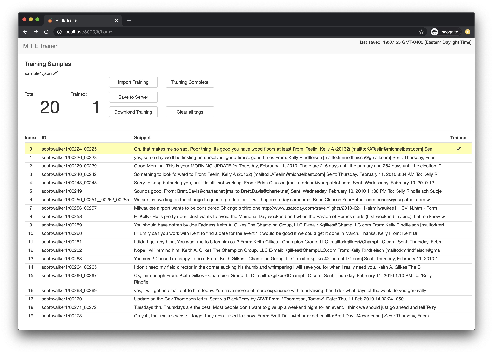
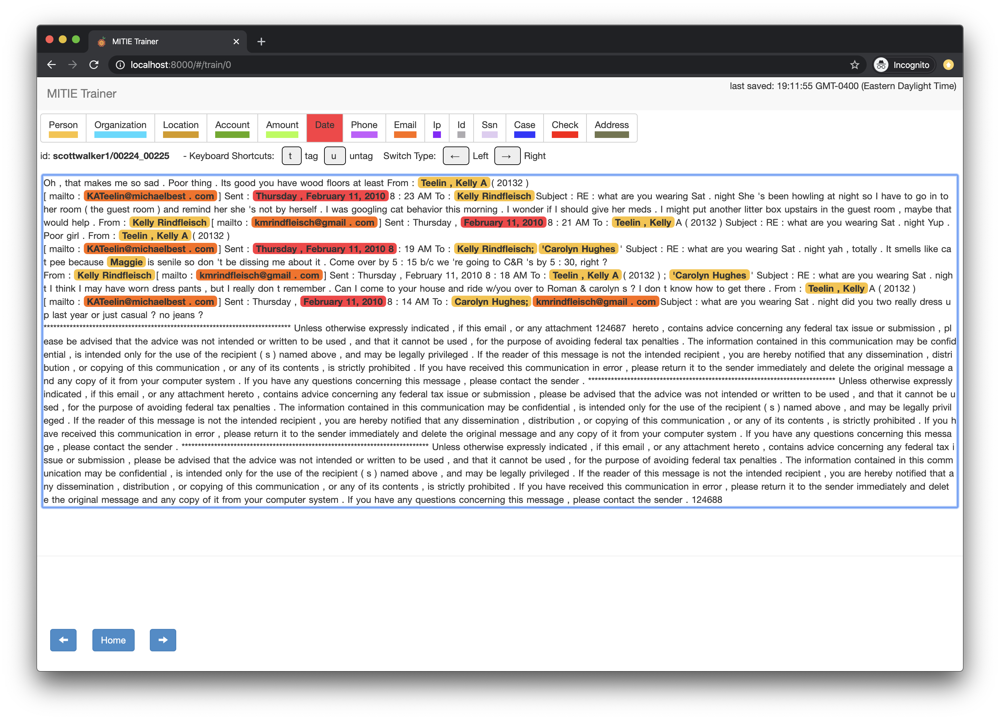
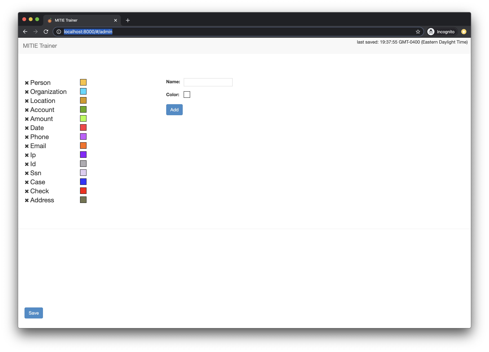

# mitie-trainer


An interactive, browser-based model training tool for
[MITIE](https://github.com/mit-nlp/MITIE). The MIT Information Extraction tool
provides fast and easily trained named entity recognition (NER) and binary relation
extraction abilities and is free for both noncommercial and commercial use.
This package is a browser-based wrapper on the training tool, allowing for
faster tagging of training data for input into MITIE.


### Setup

- If it's not already present, install Tangelo v0.6.1 `pip install -Iv tangelo==0.6.1`
- If not present install config `pip install config`
- Install [MITIE](https://github.com/mit-nlp/MITIE)
- Set the path to your MITIE home in **conf/app.cfg**

### Data

You should structure your training data in a tab-separated file (in the form`ID\tTEXT_BODY` for each row). Run this TSV through the formatting script in **tools/** to convert it into the JSON that the trainer expects. If your TSV of ids and stories were called `output.tsv` and were located in the **mitie-trainer** directory, make the JSON like this:

`cat output.tsv | ./tools/create_trainings.py > sample.json`

You may now upload the **sample.json** file do the application

Start Tangelo with **html/** as the root directory from the command line:

`tangelo start --root /path/to/mitie-trainer/html`

Navigate to where Tangelo is running in your browser (the default is 0.0.0.0:8080)


### Tools

**Model Training**

From an export of the tagger tool you can create a new model by running the **train_model.py** tool.

```
cat training_export_*.json | ./tools/train_model.py /srv/software/MITIE/MITIE-models/english/total_word_feature_extractor.dat new_ner_model.dat
```

**Tagging**

You can use the trained model to tag a training set.  This will replace all tags with tags from MITIE.

```
cat training_export_*.json | ./tools/tag_trainings.py new_ner_model.dat > tmp/tagged_sample.json
```

The newly tagged file **tagged_sample.json** can now be imported back in to the tagging tool to be evaluated

**Diff Taggings**

To get a summarized report of what was changed between too trainings files you can use the **diff_training.py** tool. This will give the report of what was added removed modified by each ID

```
./tools/diff_trainings.py training_export_*.json tmp/tagged_sample.json
```


Sample Diff Report

```
--- Summary ---
trainings in common 20
trainings modified 4
total modifications 6
total modified 0, added 3, removed 3
--- modifications by type ---
PERSON modified 0, added 3, removed 3
--- modifications ---
scottwalker1/00224_00225   -   {"start": 200, "tag": "person", "end": 202, "input_file": "A"}
scottwalker1/00224_00225   -   {"start": 346, "tag": "person", "end": 350, "input_file": "A"}
scottwalker1/00226_00228   -   {"start": 106, "tag": "person", "end": 108, "input_file": "A"}
scottwalker1/00229_00239   +   {"start": 2903, "tag": "person", "end": 2904, "score": 0.0, "input_file": "B"}
scottwalker1/00256_00257   +   {"start": 442, "tag": "person", "end": 443, "score": 0.0, "input_file": "B"}
scottwalker1/00256_00257   +   {"start": 443, "tag": "person", "end": 444, "score": 0.0, "input_file": "B"}
```


## Docker

Install Docker

Run `./build_docker.sh`

Start a container `docker run --rm -d --name mitie1 -p 8000:8000 mitie:dev`

Browse to [localhost:8000](localhost:8000)

Import the `sample.json` from the repo as an example

Navigate to [http://localhost:8000/#/admin/](http://localhost:8000/#/admin/) to modify training options


Run `docker exec -it mitie1 sh` to access scripts inside the docker container

Example of how to get text data out of docker (absent the use of volumes)
```
docker exec -it mitie1 cat /opt/mitie-trainer/sample.json > sample.json
```

Shutdown the container `docker stop mitie1` (warning this removes the container when started with `--rm` option)


## UI Example








